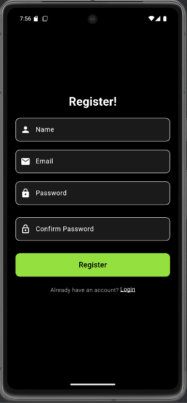
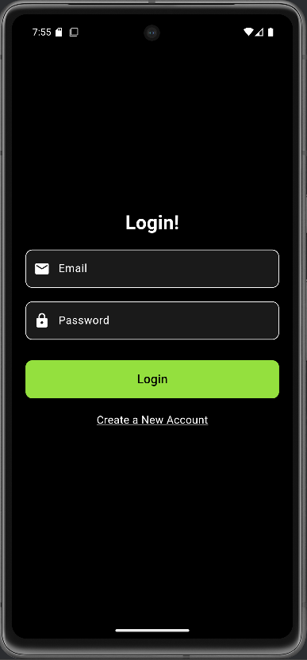
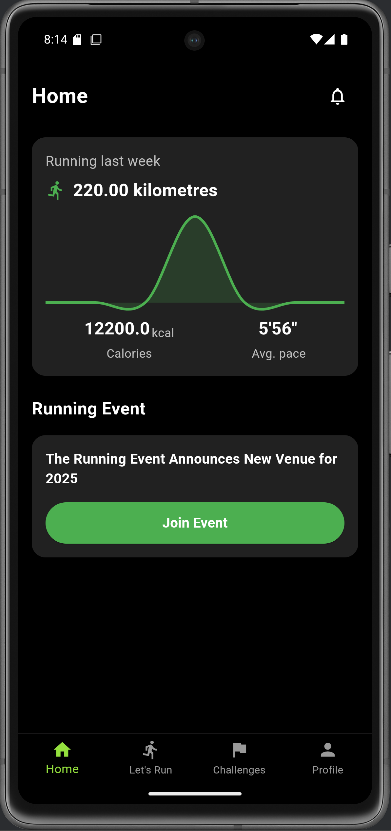

<!--Project logo and contributors-->

  <!-- Logo -->
  
  
  <!-- Title -->
  <h1 style="font-size: 2.5rem; font-weight: bold; color: #333; margin: 0;">RUNMATE</h1>
  
  <!-- Subtitle -->
  
FIT - HCMUS

  
Mobile Development

  

<!-- Contributors -->

  <h2 style="font-size: 1.4rem; color: #333; font-weight: bold; margin-bottom: 10px;">Contributors</h2>
  <ul style="list-style: none; padding: 0; margin: 0;">
    <li style="margin: 8px 0;">
      <a href="https://github.com/ngocdai101004" target="_blank" style="text-decoration: none; color: #007bff; font-size: 1rem; font-weight: 500;">
        Tran Ngoc Dai
      </a>
    </li>
    <li style="margin: 8px 0;">
      <a href="https://github.com/fusodoya" target="_blank" style="text-decoration: none; color: #007bff; font-size: 1rem; font-weight: 500;">
        Song Dong Gia Phuc
      </a>
    </li>
    <li style="margin: 8px 0;">
      <a href="https://github.com/tuongkhtn" target="_blank" style="text-decoration: none; color: #007bff; font-size: 1rem; font-weight: 500;">
        Huynh Thanh Tuong
      </a>
    </li>
    <li style="margin: 8px 0;">
      <a href="https://github.com/tuann04" target="_blank" style="text-decoration: none; color: #007bff; font-size: 1rem; font-weight: 500;">
        Vo Anh Tuan
      </a>
    </li>
  </ul>

<!--Table of contents-->

## About the project

Runmate is a mobile application designed to help users track and enhance their running activities. Built with Firebase and Google Maps API, it offers features like real-time run tracking with map integration, detailed activity stats, and streak tracking to motivate consistent running. Users can participate in challenges and events while securely managing their data, including routes and personal profiles. Runmate aims to inspire users to stay active, achieve fitness goals, and compete for better performance.

## Screens

### Register

    

- Users create new accounts by filling in personal information such as name, email, password and confirm password.

### Login

    

- Users log into the system by entering their previously registered email and password.

### Home

    

- Displays an overview of user activity, including running statistics, displaying running-related events.

### Run

### Challenge
